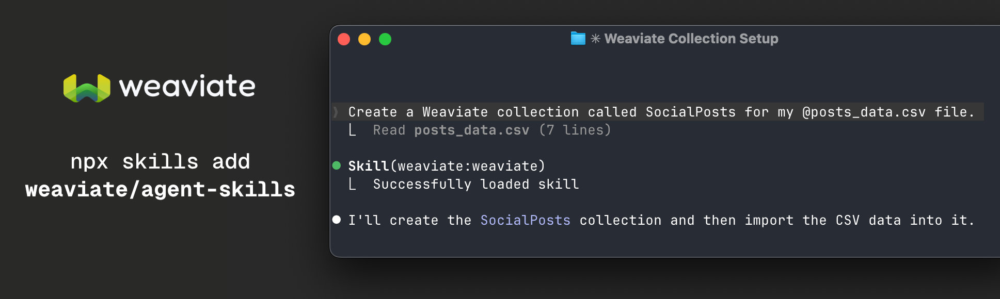

# Weaviate Agent Skills

Agent Skills to empower developers building AI applications with Weaviate.
Works with any agent that supports the [Agent Skills](https://agentskills.io/home#adoption) format.

## Installation

```bash
# Using npx skills (Cursor, Claude Code, Gemini CLI, etc.)
npx skills add weaviate/agent-skills

# Using Claude Code Plugin Manager
claude
/plugin install weaviate/agent-skills

# Manual: clone and point your agent to the directory
git clone https://github.com/weaviate/agent-skills.git

# For Claude Code, after cloning, run 
cd agent-skills
claude --plugin-dir .
```

## Configuration

### Required Environment Variables

```bash
export WEAVIATE_URL="https://your-cluster.weaviate.cloud"
export WEAVIATE_API_KEY="your-api-key"
```

### External Provider Keys (Auto-Detected)

For the complete env var list and header mapping, see:
- [Environment Requirements](./skills/cookbooks/references/environment-requirements.md)

## Usage

### Commands (Claude Code Plugin)

```bash
# Ask a question and get an AI-generated answer with source citations
/weaviate:ask query "What are the benefits of vector databases?" collections "Documentation"

# Search collections and get raw results
/weaviate:query query "machine learning tutorials" collections "Articles,BlogPosts" limit 5

# Direct search with different search types
/weaviate:search query "product SKU-123" collection "Products" type "keyword"
/weaviate:search query "similar items" collection "Products" type "semantic"
/weaviate:search query "best laptops" collection "Products" type "hybrid" alpha "0.7"
```

### Skills (Any Compatible Agent)

The skill is automatically discovered by compatible agents. Simply describe what you want:

- "Search my Weaviate documentation for information about HNSW indexing"
- "List all my Weaviate collections"
- "Find products similar to 'wireless headphones' in the Products collection"

## Requirements

- Python 3.11+
- [uv](https://docs.astral.sh/uv/) (recommended) or pip
- A Weaviate Cloud instance

## Resources

- [Weaviate Documentation](https://docs.weaviate.io/weaviate)
- [Agent Skills Specification](https://agentskills.io/specification)
- [Claude Code Plugins](https://code.claude.com/docs/en/plugins)
- [Weaviate Query Agent](https://docs.weaviate.io/agents/query)
